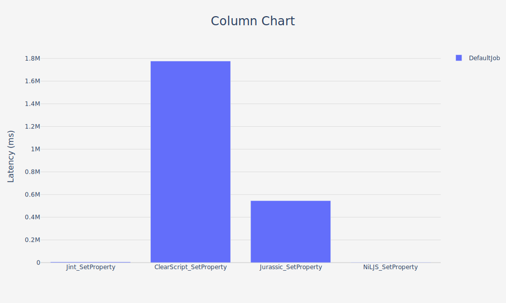

# JavascriptDotnetBenchmark

Benchmarks which compare the performance of javascript interpreters in dotnet.

## Test Machines

### Windows

BenchmarkDotNet v0.14.0, Windows 10 (10.0.19045.5011/22H2/2022Update)
Intel Core Ultra 9 185H, 1 CPU, 22 logical and 16 physical cores
.NET SDK 8.0.304
  [Host]     : .NET 8.0.10 (8.0.1024.46610), X64 RyuJIT AVX2
  DefaultJob : .NET 8.0.10 (8.0.1024.46610), X64 RyuJIT AVX2

### MacOS

## Initialization Results

### Windows

| Method                        | Mean            | Error         | StdDev         | Allocated |
|------------------------------ |----------------:|--------------:|---------------:|----------:|
| Jint_Initialization           |     2,702.28 ns |    120.916 ns |     348.869 ns |   13112 B |
| ClearScript_Initialization    | 1,834,099.29 ns | 77,783.839 ns | 225,665.039 ns |   14006 B |
| NiLJS_EngineInitialization    |        43.43 ns |      1.104 ns |       3.238 ns |     208 B |
| Jurassic_EngineInitialization |   151,040.09 ns |  4,653.415 ns |  13,720.699 ns |  386444 B |

### MacOs

## Set Property Results

### Windows

| Method                  | Mean         | Error      | StdDev      | Allocated |
|------------------------ |-------------:|-----------:|------------:|----------:|
| Jint_SetProperty        |     5.368 μs |  0.1948 μs |   0.5712 μs |  17.95 KB |
| ClearScript_SetProperty | 1,776.399 μs | 52.6308 μs | 151.0076 μs |  19.76 KB |
| Jurassic_SetProperty    |   545.480 μs | 16.5692 μs |  48.3331 μs | 399.17 KB |
| NiLJS_SetProperty       |     3.424 μs |  0.1004 μs |   0.2928 μs |   3.92 KB |

### MacOs

## Call Method Results

### Windows

| Method                 | Mean         | Error      | StdDev      | Allocated |
|----------------------- |-------------:|-----------:|------------:|----------:|
| Jint_CallMethod        |     6.964 μs |  0.1585 μs |   0.4624 μs |  19.92 KB |
| ClearScript_CallMethod | 1,776.506 μs | 39.0989 μs | 109.6374 μs |  25.04 KB |
| Jurassic_CallMethod    |   807.495 μs | 20.5911 μs |  60.3900 μs | 401.17 KB |
| NiLJS_CallMethod       |     4.155 μs |  0.1351 μs |   0.3962 μs |   3.88 KB |

### MacOs

## Large Dataset Results

### Windows

| Method                   | Mean      | Error     | StdDev    | Allocated   |
|------------------------- |----------:|----------:|----------:|------------:|
| Jint_LargeDataSet        | 46.662 ms | 1.2634 ms | 3.5840 ms | 31023.52 KB |
| ClearScript_LargeDataSet |  2.032 ms | 0.0406 ms | 0.0752 ms |   424.23 KB |
| Jurassic_LargeDataSet    |  1.741 ms | 0.0613 ms | 0.1809 ms |   844.05 KB |
| NiLJS_LargeDataSet       | 12.530 ms | 0.2906 ms | 0.8523 ms |  8219.34 KB |

### MacOs

## Parallel Execution Results

### Windows

| Method                        | Mean      | Error     | StdDev    | Allocated     |
|------------------------------ |----------:|----------:|----------:|--------------:|
| Jint_ParallelExecution        | 883.48 ms | 17.606 ms | 40.805 ms | 3743668.95 KB |
| ClearScript_ParallelExecution |  20.07 ms |  0.399 ms |  1.037 ms |     183.72 KB |
| Jurassic_ParallelExecution    | 312.55 ms |  6.195 ms | 15.769 ms | 3050993.84 KB |
| NiLJS_ParallelExecution       | 313.36 ms |  6.200 ms | 17.386 ms |  937679.41 KB |

### MacOs

## Repeated Execution Results

### Windows

| Method                        | Mean        | Error       | StdDev      | Allocated      |
|------------------------------ |------------:|------------:|------------:|---------------:|
| Jint_RepeatedExecution        | 55,669.3 ms | 1,098.76 ms | 2,244.48 ms | 37433992.52 KB |
| ClearScript_RepeatedExecution |    929.2 ms |    26.71 ms |    78.32 ms |      480.43 KB |
| Jurassic_RepeatedExecution    | 19,501.0 ms |   378.38 ms |   822.57 ms | 30472275.13 KB |
| NiLJS_RepeatedExecution       | 18,874.0 ms |   377.06 ms |   896.13 ms |  9376709.41 KB |

### MacOs

## Script Execution Results

### Windows

| Method                      | Mean      | Error     | StdDev    | Median    | Allocated    |
|---------------------------- |----------:|----------:|----------:|----------:|-------------:|
| Jint_ScriptExecution        | 533.63 ms | 16.530 ms | 48.479 ms | 514.71 ms |  374366.5 KB |
| ClearScript_ScriptExecution |  11.64 ms |  0.338 ms |  0.997 ms |  11.53 ms |     17.81 KB |
| NiLJS_ScriptExecution       | 181.99 ms |  6.608 ms | 19.381 ms | 181.39 ms |  93767.65 KB |
| Jurassic_ScriptExecution    | 186.83 ms |  4.391 ms | 12.810 ms | 183.42 ms | 305100.67 KB |

### MacOs

## Complex Object Manipulation Results

### Windows

| Method                                | Mean       | Error     | StdDev    | Median     | Allocated |
|-------------------------------------- |-----------:|----------:|----------:|-----------:|----------:|
| Jint_ComplexObjectManipulation        | 2,833.3 μs |  65.99 μs | 194.58 μs | 2,840.6 μs |  278.8 KB |
| ClearScript_ComplexObjectManipulation | 3,700.6 μs | 112.35 μs | 329.50 μs | 3,691.4 μs | 916.95 KB |
| Jurassic_ComplexObjectManipulation    | 4,391.7 μs | 155.40 μs | 458.21 μs | 4,278.2 μs | 736.56 KB |
| NiLJS_ComplexObjectManipulation       |   252.3 μs |   9.15 μs |  26.84 μs |   244.3 μs | 154.42 KB |

### MacOs

